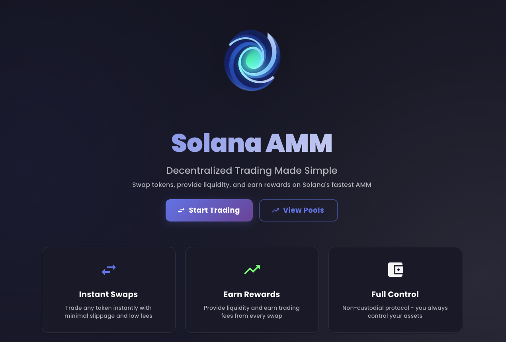

# Solana AMM

A decentralized automated market maker (AMM) built on Solana. Swap tokens, provide liquidity, and earn fees with fast transactions and low costs.



## Features

- **Token Swaps** - Trade SPL tokens instantly
- **Liquidity Pools** - Provide liquidity and earn trading fees
- **Pool Creation** - Create new pools for any token pair
- **LP Tokens** - Receive tokens representing your pool share

## Installation

### Prerequisites

- Node.js v18+
- Rust (latest stable)
- Solana CLI
- Anchor v0.30.1+

### Setup

1. **Clone the repository**
```bash
git clone https://github.com/yourusername/solana-amm.git
cd solana-amm
```

2. **Install dependencies**
```bash
# Smart contract
cd contracts
npm install

# Frontend
cd ../frontend
npm install
```

3. **Configure Solana**
```bash
# Set network (localhost/devnet/testnet)
solana config set --url localhost

# Create wallet if needed
solana-keygen new

# Get SOL for testing
solana airdrop 2
```

4. **Build and deploy contract**
```bash
cd contracts
anchor build
anchor deploy

# Copy IDL to frontend
cp target/idl/amm.json ../frontend/src/utils/idl.json
cp target/types/amm.ts ../frontend/src/utils/idltype.ts
```

5. **Update program ID**

Update `PROGRAM_ID` in `frontend/src/services/contract-service.ts` with your deployed program ID.

6. **Start frontend**
```bash
cd frontend
npm run dev
```

Open http://localhost:5173

## Usage

1. **Connect Wallet** - Connect Phantom or another Solana wallet
2. **Create Pool** - Initialize a new liquidity pool
3. **Add Liquidity** - Deposit tokens to earn fees
4. **Swap** - Exchange tokens at current pool rates

## Tech Stack

- **Smart Contract**: Rust, Anchor Framework
- **Frontend**: React, TypeScript, Material-UI
- **Blockchain**: Solana

## License

MIT

---

⚠️ Educational project. Use at your own risk.